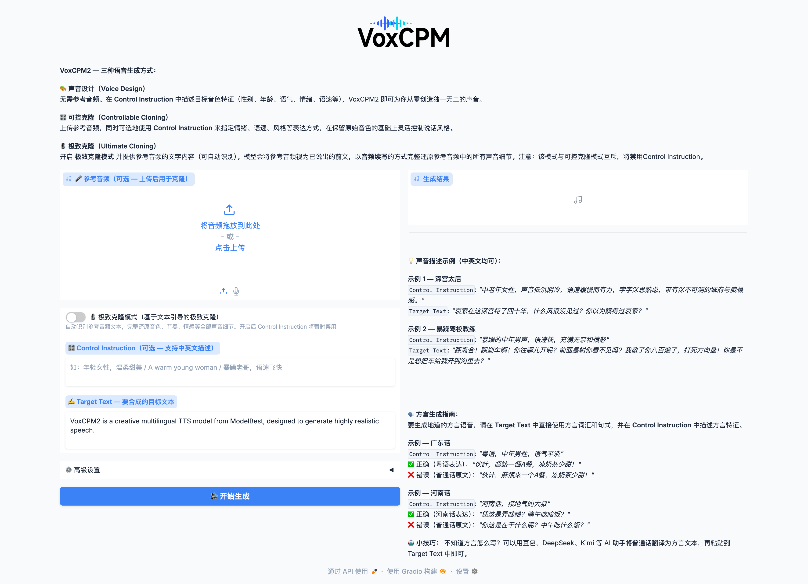

# DubCue

[简体中文](README.md) | English

> A local AI dubbing director built on VoxCPM2 for screen dubbing, documentary narration, audiobooks, explainers, and other directed voice-performance workflows.

**DubCue does not train, modify, or own the VoxCPM model.** It is a local installer, launcher, and dubbing-direction workflow built around the excellent open-source [OpenBMB/VoxCPM](https://github.com/OpenBMB/VoxCPM) project. DubCue focuses on turning text and screen context into a controllable voice-performance project.

The older **VoxCPM Easy Launcher v0.1.0-lite** release remains available as a historical version for users who only need single-clip generation and the basic launcher workflow.

## Choose A Download

> [!IMPORTANT]
> Users with a slow connection should download the full package. It already contains the approximately 4.6 GB VoxCPM2 model.
>
> **Baidu Netdisk: [Download the full macOS / Windows packages](https://pan.baidu.com/s/1pRR-aB4NA1Dby3Goh6oA_Q?pwd=sjnb)**
>
> **Access code: `sjnb`**

| Package | Size | Local model | Internet during setup |
|---|---:|---|---|
| GitHub Lite | About 3 MB | Not included | Automatically downloads dependencies, FFmpeg, and the approximately 4.6 GB model |
| Full package | About 4–6 GB | Included | Does not re-download the main model; dependencies or FFmpeg may still require internet access |

**[Download the Lite packages from GitHub Releases](https://github.com/songjiankindle-web/DubCue/releases/latest)**

## Visit The Original Project

The model, inference code, research, and core capabilities belong to the OpenBMB / ModelBest team:

- **Official GitHub:** [OpenBMB/VoxCPM](https://github.com/OpenBMB/VoxCPM)
- **Official online demo:** [Hugging Face Space](https://huggingface.co/spaces/OpenBMB/VoxCPM-Demo)
- **Official China demo:** [voxcpm.modelbest.cn](https://voxcpm.modelbest.cn/)
- **Documentation:** [VoxCPM Documentation](https://voxcpm.readthedocs.io/en/latest/)
- **Model weights:** [Hugging Face](https://huggingface.co/openbmb/VoxCPM2) / [ModelScope](https://modelscope.cn/models/OpenBMB/VoxCPM2)

Please read, follow, and support the original project first. This repository is unofficial and is not affiliated with or endorsed by OpenBMB or ModelBest.

## What This Wrapper Adds

- Guided macOS and Windows installation
- Double-click launchers
- An isolated Python virtual environment
- A browser-based local GUI instead of terminal commands
- Voice design, controllable cloning, and transcript-guided cloning
- Long-form narration mode
- Semantic script splitting instead of fixed-length chopping
- Automatic per-segment emotion, speed, and prompt drafting
- An editable Director Table for manual control
- Rolling continuity context to keep long scripts more consistent
- Segment WAV files, a final WAV, and `manifest.json`
- Local inference after installation
- No Codex, ChatGPT, or agent dependency
- No API-token usage for local generation

The GUI is a desktop-oriented packaging and launch adaptation of the Gradio demo provided by the VoxCPM project, extended with the DubCue dubbing-director workflow.

## DubCue Dubbing Director Workflow

Long-form mode does not ask the model to synthesize thousands of characters in one pass. It turns a script into a controllable narration project:

1. Paste or upload a script.
2. Build a Director Table.
3. Manually edit segment text, emotion, speed, prompt, and pauses.
4. Generate and save each segment.
5. Assemble the final narration audio.

Splitting prefers paragraph and full-sentence boundaries such as periods, question marks, exclamation marks, and ellipses. Commas and weaker pauses are used only for very long sentences.

See [DubCue Upgrade Notes](DUBCUE_UPGRADE.md) for implementation notes and limitations.

## Interface

## Downloads

GitHub Releases provide Lite installers without model weights. Full installers with local model weights are distributed through Baidu Netdisk.

See **[Downloads and installation](DOWNLOADS.md)** for links and checksums.

## Local Use And Privacy

After installation, normal synthesis and voice cloning run locally. They do not use Codex, ChatGPT, or another agent, and do not consume API tokens.

Internet access may still be needed for initial Python dependencies, FFmpeg, optional ASR models, or official online services selected by the user.

Do not use voice cloning for impersonation, fraud, or misinformation. Obtain permission before using another person's voice and clearly label AI-generated content.

## Requirements

- macOS Apple Silicon or 64-bit Windows 10/11
- Python 3.10–3.12; Python 3.11 recommended
- NVIDIA GPU recommended on Windows; CPU inference can be very slow

Python 3.13/3.14 are not recommended until the complete VoxCPM dependency chain has been reliably validated on them.

## Acknowledgements

Special thanks to:

- [OpenBMB/VoxCPM](https://github.com/OpenBMB/VoxCPM) and all contributors
- The OpenBMB and ModelBest teams
- PyTorch, Gradio, Hugging Face, ModelScope, FFmpeg, and their communities

If VoxCPM helps you, please star and support the [original repository](https://github.com/OpenBMB/VoxCPM).

## License And Attribution

The wrapper documentation, installer scripts, and launcher code in this repository use the [MIT License](LICENSE).

VoxCPM source code, model weights, names, logos, and related assets remain subject to their original licenses and attribution. This repository's MIT License does not replace them.
